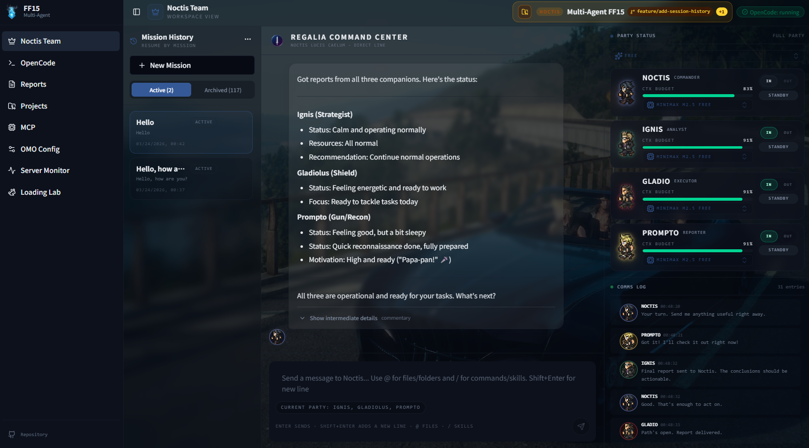

<div align="center">

# multi-agent-ff15

**OpenCode Multi-Agent Web Dashboard**

*Manage and monitor your AI agent team from a browser*

[](https://github.com/atman-33/multi-agent-ff15)
[](https://opensource.org/licenses/MIT)
[](https://opencode.ai)
[]()
[]()

</div>

<p align="center">
  
</p>

<p align="center"><i>Noctis Team screen — dispatch missions to your AI agents and monitor their sessions in real time</i></p>

---

**multi-agent-ff15** is a web-based dashboard that brings the FF15-inspired multi-agent system to life in a browser. You orchestrate **Noctis** (King) and the comrades (Ignis, Gladiolus, Prompto) through a polished React UI backed by live OpenCode sessions — no tmux knowledge required.
Lunafreya and Iris are planned for a future release.

> **Built on**: [OpenCode](https://opencode.ai) · React Router 7 · TypeScript

---

## Overview

Multi-agent parallel development framework using OpenCode.
Inspired by FINAL FANTASY XV's Kingdom of Lucis.

### Agent Hierarchy

```
User
    │
    ▼
┌──────────┐
│ NOCTIS   │ ← King (Leader + Task Mgr)
│  (王)    │
└────┬─────┘
     │ missions / sessions
     ▼
┌────────────┬──────────┬────────────┐
│   IGNIS    │GLADIOLUS │  PROMPTO   │ ← Comrades (3)
│  (軍師)    │  (盾)    │   (銃)     │
└────────────┴──────────┴────────────┘
```

### Communication Flow

- **User → Noctis**: Mission dispatch via the Noctis Team screen
- **Noctis → Comrades**: Task delegation through OpenCode agent sessions
- All agent sessions are visible live in the web dashboard

---

## 🚀 Quick Start

### Prerequisites

- Node.js 20+
- npm 10+
- [OpenCode](https://opencode.ai) CLI (authenticated)

### Step 1: Clone & initial setup

```bash
git clone https://github.com/atman-33/multi-agent-ff15.git
cd multi-agent-ff15
./first_setup.sh
```

`first_setup.sh` installs required dependencies (uv/uvx for Serena MCP) and verifies the environment.

### Step 2: Authenticate OpenCode (first time only)

```bash
source ~/.bashrc
opencode
# → Select your AI model provider
# → Follow the authentication prompts
# → Type /exit to quit
```

Credentials are saved to `~/.opencode/` and never need to be entered again.

### Step 3: Build the web app (first time only)

```bash
./standby.sh --build
```

### Step 4: Daily startup

```bash
./standby.sh
```

The app starts on **`http://localhost:13000`** and the browser opens automatically.

---

## 🖥️ Web App Screens

### Noctis Team

The primary command screen. Send missions to Noctis and watch the agent team respond in real time.

| Feature | Description |
|---------|-------------|
| Mission dispatch | Send a task to Noctis with a single message |
| Agent session view | Live output from each agent's OpenCode session |
| Mission history | Browse past missions and their outcomes |

### OpenCode Sessions

Inspect any OpenCode session directly in the browser — full message history, tool calls, and model activity.

### Projects

Switch the active project context. The selected project is injected as instructions into each agent session automatically.

### Reports

Browse and read Markdown reports generated by agents, with table-of-contents navigation.

### MCP

View the MCP (Model Context Protocol) server configuration used by OpenCode agents.

### Server

Monitor the OpenCode server status — connection health, errors, and active sessions.

---

## ⚙️ Configuration

### Language

Edit `config/settings.yaml`:

```yaml
language: ja   # Japanese responses
language: en   # English responses
```

### Web port

The web app runs on port `13000` by default. To change it, edit `standby.sh`:

```bash
WEB_PORT=13000   # Change to any available port
```

---

## 🛠️ Development

Start the development server with HMR:

```bash
npm run web:dev
```

App available at `http://localhost:5173`.

### Other commands

```bash
npm run web:install    # Install dependencies
npm run web:build      # Production build
npm run web:start      # Start production server
npm run web:typecheck  # Type check
npm run web:lint       # Lint
npm run web:test       # Run tests
```

---

## 🗂️ Project Structure

```
multi-agent-ff15/
├── standby.sh              # Daily startup script (launch + browser open)
├── first_setup.sh          # One-time environment setup
├── config/
│   ├── settings.yaml       # Language and app settings
│   └── models.yaml         # Agent model configuration
├── web/                    # React Router 7 web app
│   └── app/
│       ├── routes/         # Page routes
│       │   ├── _layout.noctis-team/   # Noctis Team screen
│       │   ├── _layout.opencode/      # OpenCode session viewer
│       │   ├── _layout.projects/      # Project management
│       │   ├── _layout.reports/       # Report browser
│       │   ├── _layout.mcp/           # MCP config viewer
│       │   └── _layout.server/        # Server status
│       ├── lib/            # Shared utilities
│       └── stores/         # Zustand state stores
├── docs/
│   └── reports/            # Agent-generated reports
├── runtime/
│   ├── opencode-session-state.json
│   └── noctis-missions/    # Mission records (JSON)
├── projects/               # Project configuration files
└── .opencode/              # OpenCode agent definitions
```

---

## 🧩 Tech Stack

| Layer | Technology |
|-------|-----------|
| Framework | React Router 7 (SSR) |
| Language | TypeScript |
| UI | React 19 + Tailwind CSS v4 |
| Components | shadcn/ui (Radix UI primitives) |
| State | Zustand |
| Build | Vite 7 |
| AI runtime | OpenCode CLI |
| MCP | Serena (semantic coding tools) |

---

## 👥 Agent Roster

| Agent | Role | Symbol | Status |
|-------|------|--------|--------|
| Noctis | King — receives missions, commands the comrades | 👑 | ✅ Implemented |
| Ignis | Strategist comrade | ⚔ | ✅ Implemented |
| Gladiolus | Shield comrade | 🛡 | ✅ Implemented |
| Prompto | Recon comrade | 🔫 | ✅ Implemented |
| Iris | Guardian / gatekeeper | 🌸 | 🔜 Planned |
| Lunafreya | Oracle — independent advisor | ✨ | 🔜 Planned |

The user is referred to as **User** by all agents.

---

## 🙏 Credits

Inspired by [multi-agent-shogun](https://github.com/yohey-w/multi-agent-shogun) by [@yohey-w](https://github.com/yohey-w) and the original multi-agent-ff15 design.

---

## 📄 License

MIT License — See [LICENSE](LICENSE) for details.

---

<div align="center">

**Command your AI team. Ship faster.**

</div>
