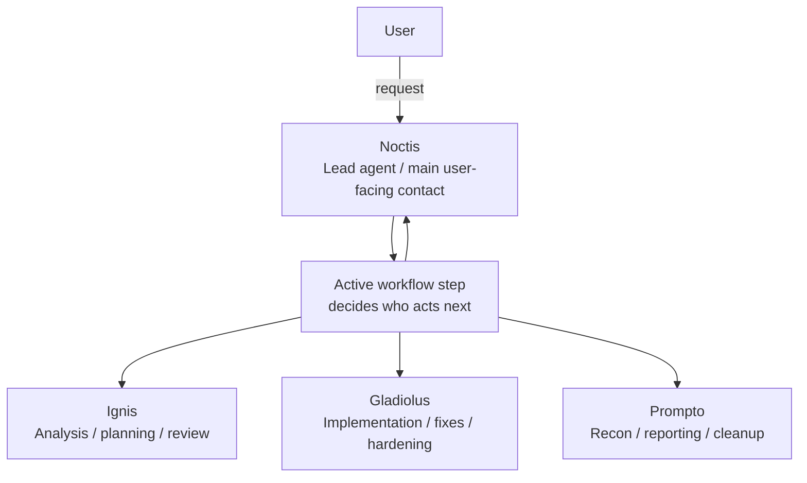

<div align="center">

# multi-agent-ff15

**OpenCode Multi-Agent Web Dashboard**

*Manage and monitor your AI agent team from a browser*

[](https://github.com/atman-33/multi-agent-ff15)
[](https://opensource.org/licenses/MIT)
[](https://opencode.ai)
[]()
[]()

</div>

<p align="center">
	
</p>

<p align="center"><i>Noctis Team screen — dispatch missions and monitor agent activity in real time</i></p>

---

`multi-agent-ff15` is the current browser-first application for FF15-inspired OpenCode workflows. It replaces the older desktop/Tauri app in this repository and turns a tmux-heavy multi-agent setup into a single browser surface for dispatching work, monitoring sessions, reviewing reports, and inspecting runtime state.

> **Built on**: [OpenCode](https://opencode.ai) · React Router 7 · TypeScript

## Why Use It

- Run Noctis-led multi-agent workflows from a browser instead of living in tmux.
- See what agents actually did through live sessions, tool traces, and reports.
- Keep missions, projects, configuration, MCP state, and runtime health in one place.

## Overview

The dashboard is organized around a human workflow rather than raw runtime internals:

- `Noctis Team`: start work and watch party activity
- `OpenCode Sessions`: inspect session history, tool calls, models, and context/execution selection
- `Reports`: review long-form output after a mission finishes
- `Projects`: choose where work runs and launch the right workspace
- `Config`: edit app settings and bootstrap required local config
- `MCP` and `Server`: inspect MCP configuration and OpenCode runtime state

### Typical Flow

1. Send a mission from `Noctis Team`.
2. Watch the party respond and inspect detailed session activity.
3. Open `Reports` when you need a cleaner long-form result.
4. Use `Projects`, `Config`, `MCP`, or `Server` when you need execution context or runtime debugging.

### Agent Relationships



- `Noctis` is the lead agent and the main user-facing contact.
- `Ignis`, `Gladiolus`, and `Prompto` are specialist teammates.
- The human user is referred to as `User`.
- `Iris` and `Lunafreya` are not part of the primary shipped browser workflow yet.

## Quick Start

### Prerequisites

- Node.js 20+
- npm 10+
- [OpenCode](https://opencode.ai) CLI with an authenticated provider account

### 1. Initial setup

```bash
git clone https://github.com/atman-33/multi-agent-ff15.git
cd multi-agent-ff15
./first_setup.sh
```

`first_setup.sh` installs `tmux` and `uv/uvx` when needed, enables tmux mouse scrolling, creates local `opencode.json` from `config/opencode.template.json`, and initializes `transport_mode: tmux-resident` in `config/settings.yaml` when missing.

### 2. Authenticate OpenCode

```bash
source ~/.bashrc
opencode
```

Credentials are stored in `~/.opencode/`.

### 3. Build once

```bash
./standby.sh --build
```

### 4. Start the dashboard

```bash
./standby.sh
```

The app runs at `http://localhost:13000`. When `transport_mode` is `tmux-resident`, interactive runs attach to the `ff15` tmux session by default. Use `./standby.sh --no-attach` to keep the current shell detached, or `./standby.sh --attach` to force attachment explicitly.

## Product Tour

| Screen | Purpose |
|-------|---------|
| Noctis Team | Main mission surface for dispatch, activity, and mission history |
| OpenCode Sessions | Detailed session viewer for messages, tools, models, and execution context |
| Reports | Long-form report browser for reviewing outcomes after the live run |
| Projects | Project registry and workspace launch surface |
| Config | App settings and local config bootstrap helpers |
| MCP / Server | Runtime inspection for MCP configuration, health, and server state |

## Configuration

Tracked defaults live in `config/`.

- `config/settings.yaml`: `language`, `shared_skills_root`, `transport_mode`
- `config/models.yaml`: model assignments and switching metadata
- `config/opencode.template.json`: tracked template for the local `opencode.json`

`opencode.json` is user-local runtime config. It is bootstrapped by `first_setup.sh` and should not be treated as the canonical tracked template.

Use `./standby.sh --set-transport app-owned` or `./standby.sh --set-transport tmux-resident` to switch transport mode explicitly.

## Development

Use the root npm scripts for web work:

```bash
npm run web:install
npm run web:dev
npm run web:build
npm run web:start
npm run web:typecheck
npm run web:lint
npm run web:test
```

`npm run web:dev` serves the app on port `5173` by default. `./standby.sh` runs the production server on port `13000`.

## Repository Map

- `web/`: React Router app, loaders/actions, API routes, and UI state
- `scripts/`: setup, startup, transport, and config helpers
- `config/`: tracked settings, models, and local config templates
- `projects/`: project definitions used by the UI and workflows
- `builtins/`: localized built-in operation and instruction assets
- `skills/`: shared skills used by the workflow system
- `openspec/`: OpenSpec changes and specs
- `docs/reports/`: active report artifacts
- `runtime/`: generated runtime state and transport/session artifacts
- `logs/`: debug logs
- `assets/`: static images used by docs and the UI

## Notes for Contributors and Agents

- Treat `runtime/` and `logs/` as generated state unless you are changing the code that produces them.
- Put active reports in `docs/reports/`.
- Prefer the root npm scripts for `web/` tasks instead of running ad-hoc commands inside `web/`.

## Credits

Inspired by [multi-agent-shogun](https://github.com/yohey-w/multi-agent-shogun) by [@yohey-w](https://github.com/yohey-w) and the original multi-agent-ff15 design.

## License

MIT License.
